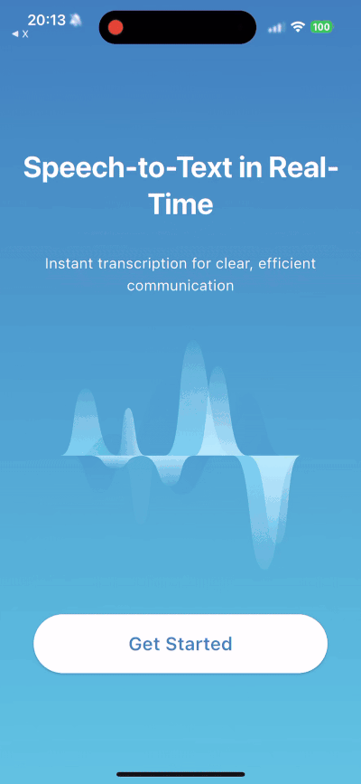
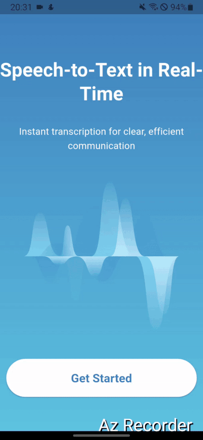
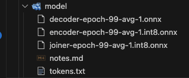
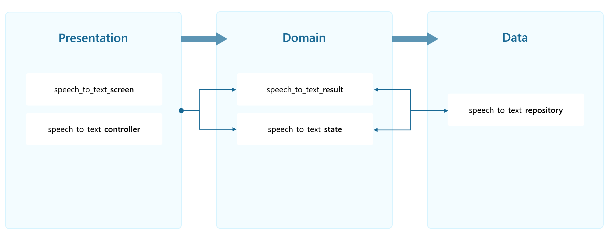

<h1 align="center">
  MedParser
</h1>

<h4 align="center">Flutter Application that recognizes speech and converts it to Text with real time and offline</h4>

<p align="center">
  <a href="#key-features">Key Features</a> •
  <a href="#how-to-use">How To Use</a> •
  <a href="#code-generation">Code Generation</a> •
  <a href="#credits">Credits</a> •
</p>

<center>
<table>
  <tr>
    <td align="center">
      <br/>
      <b>iOS Demo</b>
    </td>
    <td align="center">
      <br/>
      <b>Android Demo</b>
    </td>
  </tr>
</table>
</center>

## Key Features
* **Core Framework**: Built with Flutter and the Dart programming language.
* **State Management**: Riverpod for managing application state.
* **Audio Recording**: Uses the microphone of the device (tested on iOS & Android)
* **Testing**: Unit & Widget test & basic Integration test
* **Localization**: Implements Internationalization using [Flutter's localization features](https://docs.flutter.dev/ui/accessibility-and-internationalization/internationalization) configured in l10n.yaml
* **Flutter Version Management**: Uses FVM (.fvmrc) to manage the Flutter SDK version.
* **Speech Recognition**: Incorporates ONNX models for on-device speech recognition.
* **Onboarding**: Handles first-time user flow, completion state is persisted with shared preferences.

## How To Use

- Make sure [FVM](https://fvm.app) is installed and Flutter 3.32.4 is installed
- Download a [zipformer model](https://github.com/k2-fsa/sherpa-onnx/releases/tag/asr-models) and place it in assets/model and make sure to reflect the name of the model in the respective [class](https://github.com/Halimeh-manaf/med_parser/blob/08155ad498205a13de6f789aa11e532cb073f7a8/lib/features/speech_to_text/data/speech_to_text_repository.dart#L86). The App was built and tested using [this model](https://github.com/k2-fsa/sherpa-onnx/releases/download/asr-models/sherpa-onnx-streaming-zipformer-bilingual-zh-en-2023-02-20-mobile.tar.bz2). 

- For more information about the model, you can [read more here](https://github.com/k2-fsa/sherpa-onnx/releases/download/asr-models/sherpa-onnx-streaming-zipformer-bilingual-zh-en-2023-02-20-mobile.tar.bz2)
- Finally, simply run `fvm flutter run -d <device_id>`

> **Note**
> The assets folder should look like this after importing the model:


## Architecture
The application is following 'reference architecture' which helps to seperate between UI, business logic and data layer (aka seperation of concerns).

- **Presentation**: the UI layer (e.g., buttons, text) and its controllers (e.g., updating, displaying). Generally, you will find two types inside it:
  - widget/screen: the actual UI elements
  - controller: manages the widget/screen state (providers). 
- **Domain**: the data model (simple and immutable classes)
- **Data:**: Everything related to receive and manipulating the data. In this application, we mainly have repositories to access the data (microphone/shared preferences) and run the model.
The folders are feature-based structured. Each feature has its own data, domain and presentation layer. 

## Code Generation
The code uses riverpod generator for boilerplate code. To generate the respective files. Run in your terminal:
```bash
dart run build_runner build --delete-conflicting-outputs
```

## Credits

This software uses the following open source packages:

- [Time Tracking app with Flutter & Firebase](https://github.com/bizz84/starter_architecture_flutter_firebase/tree/master)
- [sherpa-onnx](https://github.com/k2-fsa/sherpa-onnx/tree/master)
- [Zipformer: A faster and better encoder for automatic speech recognition](https://arxiv.org/abs/2310.11230)
